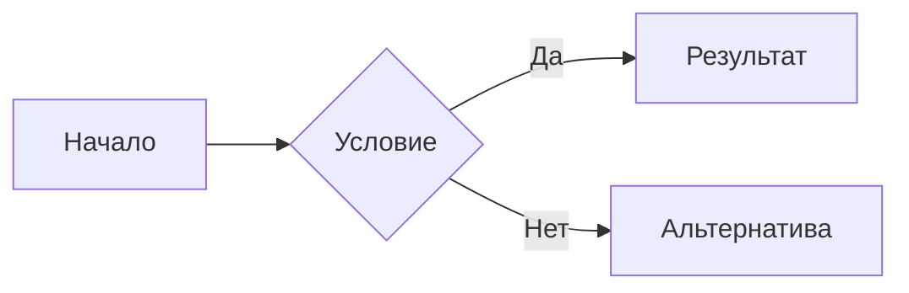

# Руководство редактора

Этот документ поможет вам писать красивые и структурированные статьи для **Большой Энциклопедии NewEra и Эррландии**. Основной и самый удобный способ работы — **Decap CMS** (редактор в браузере). Знание HTML или программирования не требуется.

---

## 1. Decap CMS — основной способ работы

Decap CMS — это визуальный редактор, встроенный прямо в наш сайт. Вы работаете с формами и кнопками, а система сама формирует Markdown-файл и отправляет его на модерацию.

### Как открыть редактор

Перейдите по адресу:

```
https://northfern.github.io/NewEraWiki/admin/
```

Авторизация происходит через GitHub. Если у вас ещё нет аккаунта GitHub — зарегистрируйтесь, это займёт две минуты.

!!! tip "Открытое авторство"
    У нас включён режим **Open Authoring**. Это значит, что любой человек с GitHub-аккаунтом может предложить правку или новую статью. Ваш вклад попадёт на проверку через Pull Request.

### Рабочий процесс

Все изменения проходят через редакционный конвейер:

| Статус | Что это значит |
|---|---|
| **Draft** | Черновик виден только вам. Пишите, исправляйте, дорабатывайте. |
| **In Review** | Вы отправили статью на проверку модераторам. |
| **Ready** | Модератор одобрил текст. Статья ожидает публикации. |
| **Published** | Статья опубликована и видна всем на сайте. |

!!! note ""
    Вы не сломаете сайт. Пока статья не прошла все этапы, читатели её не увидят.

### Коллекции (разделы энциклопедии)

В левой панели CMS вы увидите разделы. Каждый раздел — это **коллекция** с набором полей:

| Коллекция | Что сюда писать | Ключевые поля |
|---|---|---|
| **Книги** | Литературные произведения лора | Название, Автор текста, Дата, Источник (URL), Текст |
| **Личности** | Персонажи, исторические фигуры | Имя, Роль, Фракция, Автор текста, Текст |
| **Города** | Населённые пункты | Название, Государство, Автор текста, Текст |
| **Документы** | Конституции, законы, статьи | Название, Тип документа, Дата, Автор текста, Текст |
| **События и войны** | Исторические события | Название, Тип (война / политическое), Период, Текст |
| **Организации** | Государства, партии, союзы | Название, Тип, Лидер, Автор текста, Текст |
| **Символика** | Флаги, гимны, эмблемы | Название, Тип, Принадлежность, Текст |
| **Термины и идеологии** | Понятия, доктрины, фразеологизмы | Термин, Тип, Текст |

### Создание новой статьи

1. Выберите нужную коллекцию в левой панели.
2. Нажмите **«New»** (или «Создать»).
3. Заполните поля формы. Поле **«Текст»** — это основной Markdown-редактор.
4. Нажмите **«Save»** — статья уйдёт в черновики.
5. Когда будете готовы — перетащите карточку в колонку **«In Review»**.

### Редактирование существующей статьи

1. Откройте нужную коллекцию.
2. Найдите статью в списке (работает поиск).
3. Нажмите на неё, внесите правки.
4. Сохраните. Изменение уйдёт на модерацию.

Так же редактировать существующие статьи можно нажатием на символ карандаша у заголовка.

### Метаданные: автор, дата, источник

Поля **«Автор текста»**, **«Дата»** и **«Источник»** в коллекции «Книги» (и аналогичные в других коллекциях) не просто хранятся — они отображаются на опубликованной странице в виде **баннера над текстом статьи**:

> **Автор:** *ИмяАвтора* · *12 мая 2026* · **Источник:** [ссылка](https://example.com)

!!! warning "Формат даты"
    Дату пишите в кавычках и в человекочитаемом виде: `"12 мая 2026"`. Не используйте машинные форматы вроде `2026-05-12`.

---

## 2. Визуальные компоненты редактора CMS

В редакторе CMS есть панель компонентов. Вам не нужно запоминать синтаксис Markdown — вы заполняете форму, а система сама генерирует разметку.

### Блок-примечание (Admonition)

Компонент **«Блок-примечание»** на панели редактора.

Поля:

- **Тип** — выбираете из списка: `note`, `abstract`, `info`, `tip`, `success`, `question`, `warning`, `failure`, `danger`, `bug`, `example`, `quote`.
- **Заголовок** — необязательный. Если оставить пустым, будет использовано название типа.
- **Содержимое** — текст внутри блока (Markdown поддерживается).

### Спойлер (Details)

Компонент **«Спойлер (details)»**.

Поля те же, что у Admonition, плюс переключатель **«Раскрыт по умолчанию»**. Читатель увидит сворачиваемый блок и сможет кликнуть, чтобы развернуть текст.

### Вкладки (Tabs)

Компонент **«Вкладки»**.

Вы добавляете список вкладок, для каждой указываете заголовок и содержимое. Идеально для сравнений, альтернативных версий лора, точек зрения разных фракций.

### Диаграмма Mermaid

Компонент **«Диаграмма Mermaid»**. Вставляете код диаграммы в текстовое поле. Поддерживаются все стандартные типы: `graph`, `sequenceDiagram`, `timeline`, `pie`, `classDiagram` и др.

### Вики-ссылка

Компонент **«Вики-ссылка `[[ссылка|текст]]`»**. Указываете страницу и (необязательно) текст ссылки. Работает через плагины `obsidian-support` и `roamlinks`. Допустимы так же стандартные `[текст](ссылка)`

### Вставка файла (Snippet)

Компонент **«Вставка файла (snippet)»**. Вставляете путь к файлу, и его содержимое подтянется в статью при сборке.

---

## 3. Основы Markdown {#markdown}

Поле «Текст» в CMS — это полноценный Markdown-редактор. Даже если вы пользуетесь компонентами, базовую разметку знать полезно.

### Заголовки

```markdown
# Заголовок 1 (один на страницу — в самом верху)
## Заголовок 2 (основные разделы)
### Заголовок 3 (подразделы)
#### Заголовок 4 (редко)
```

### Форматирование

```markdown
**Жирный текст** — акценты и важные термины.
*Курсив* — названия книг, мысли.
~~Зачёркнутый~~ — редко.
`Код в строке` — специфичные термины, идентификаторы.
```

### Списки

```markdown
- Маркированный список
  - Вложенный (отступ 2 пробела)

1. Нумерованный список
2. Второй пункт
```

### Ссылки

```markdown
[Текст ссылки](название-файла.md)        ← внутренняя ссылка
[Внешняя ссылка](https://example.com)     ← ссылка в интернет
[[Название страницы]]                     ← вики-ссылка (obsidian-style)
[[Название страницы|Текст ссылки]]        ← вики-ссылка с алиасом
```

### Сноски

```markdown
Текст со сноской.[^1]

[^1]: Текст сноски.
```

---

## 4. Фишки движка Material

Если вы пишете напрямую в Markdown (через CMS-редактор в режиме исходника или через GitHub), доступны расширенные блоки.

### Admonition вручную

```markdown
!!! note "Заголовок"
    Текст блока. Отступ 4 пробела.
```

### Спойлер вручную

```markdown
??? warning "Нажми, чтобы раскрыть"
    Скрытый текст.
```

Раскрытый по умолчанию:

```markdown
???+ info "Уже открыт"
    Текст.
```

### Вкладки вручную

```markdown
=== "Вкладка 1"
    Текст первой.

=== "Вкладка 2"
    Текст второй.
```

### Карточки (Grid Cards)

```markdown
<div class="grid cards" markdown>

-   :fontawesome-solid-user:{ .lg .middle } **Имя**

    ---

    Краткое описание.

    [Подробнее](article.md)

-   :fontawesome-solid-house:{ .lg .middle } **Название**

    ---

    Описание.

    [Подробнее](article.md)

</div>
```

### Диаграммы Mermaid

````markdown

````

### Эмодзи

```markdown
:fontawesome-brands-discord: — иконка Discord
:material-flag-variant: — иконка флага
:smile: — эмодзи из набора Twemoji
```

---

## 5. Работа с изображениями

### Загрузка через CMS

В редакторе CMS есть медиа-библиотека. Нажмите кнопку вставки изображения в тулбаре редактора текста, выберите файл или загрузите новый. Файл попадёт в папку `docs/images/`.

### Ручная вставка

```markdown

```
или
```markdown
![[название картинки]]
```

### Картинка с подписью и ленивой загрузкой

```markdown
<figure markdown>
  { width="500" loading=lazy }
  <figcaption>Подпись под картинкой</figcaption>
</figure>
```

!!! tip ""
    Всегда добавляйте атрибут `loading=lazy` — это ускоряет загрузку страницы.

### Переключение по теме (светлая / тёмная)

```markdown
{ .theme-light }
{ .theme-dark }
```

### Галерея

```markdown
<div class="grid" markdown>


</div>
```

---
## 6. js и html расширения
Так же у нас есть несколько дополнений, без которых красивую статью было бы написать чуть сложнее

### Уменьшение текста
```html
<small>
Текст
</small>
```

### Центровка текста
```js
текст
{:.center}
```

### Центровка изображений
```markdown
{.center-img}
```
или
```markdown
![[название картинки]]{.center-img}
```

### <span style="background-color: #ff9800; color: white; padding: 2px 6px; border-radius: 4px; font-weight: bold; font-size: 0.8em;">16+</span>
```html
<span style="background-color: #ff9800; color: white; padding: 2px 6px; border-radius: 4px; font-weight: bold; font-size: 0.8em;">16+</span>
```
(Справа от названия или предупреждением в самом верху статьи)

### <span style="background-color: #ff0000; color: white; padding: 2px 6px; border-radius: 4px; font-weight: bold; font-size: 0.8em;">18+</span>
```html
<span style="background-color: #ff0000; color: white; padding: 2px 6px; border-radius: 4px; font-weight: bold; font-size: 0.8em;">18+</span>
```
(Справа от названия или предупреждением в самом верху статьи)

### Прочее
Аналогично работает и многий другой html синтаксис.

---
## 6. Альтернативный способ: GitHub напрямую

Если вам нужно быстро поправить одну строку или вы предпочитаете работать с файлами напрямую.

### Редактирование существующей статьи

1. Откройте github
2. Найдите нужную статью
3. Нажмите ✏️  (правый верхний угол).
4. Внесите правки.
5. Внизу заполните **Commit message**, оставьте «Create a new branch».
6. Нажмите **«Propose changes»** → **«Create pull request»**.

### Создание новой статьи через GitHub

1. Перейдите в нужную папку: `docs/books/`, `docs/characters/`, `docs/cities/`, `docs/documents/`, `docs/events/`, `docs/organisations/`, `docs/symbols/`, `docs/termins/`.
2. Нажмите **«Add file» → «Create new file»**.
3. Имя файла: латиница, нижний регистр, дефисы, расширение `.md`.
4. Напишите текст, сохраните через **«Propose new file»**.

### Правила именования файлов

| Правильно              | Неправильно            |
| ---------------------- | ---------------------- |
| `errland-history.md`   | `Эррландия история.md` |
| `battle-of-latonik.md` | `Battle of Latonik.md` |
| `char-eria.md`         | `Char Eria.md`         |
| `чертный-март.md`      | `Черный Март.md`       |
Слова могут быть написаны на любом языке, однако в названиях полностью должны отсутствовать спецсимволы и пробелы, от чего более безопасными способами являются английский и русский. Старайтесь называть статьи просто и понятно.

---

## 7. Структура проекта

```
docs/
├── books/            ← Книги
├── characters/       ← Личности
├── cities/           ← Города
├── documents/        ← Документы
├── events/           ← События и войны
├── organisations/    ← Организации
├── symbols/          ← Символика
├── termins/          ← Термины и идеологии
├── images/           ← Все изображения
└── index.md          ← Главная страница
```

Благодаря плагину **awesome-pages** вам не нужно редактировать навигацию вручную. Файл появляется в меню автоматически.

---

## 8. Используемые плагины и расширения

Для понимания, что доступно «под капотом»:

| Плагин / расширение | Назначение |
|---|---|
| `awesome-pages` | Автоматическое меню без ручной настройки |
| `obsidian-support` / `roamlinks` | Вики-ссылки `[[страница]]` |
| `git-authors` | Список авторов статьи (из истории Git) |
| `git-revision-date-localized` | Дата последнего изменения на странице |
| `blog` | Блог с RSS-лентой |
| `pymdownx.superfences` | Диаграммы Mermaid, блоки кода |
| `pymdownx.tabbed` | Вкладки |
| `pymdownx.details` | Сворачиваемые блоки |
| `pymdownx.snippets` | Вставка содержимого файлов |
| `pymdownx.emoji` | Эмодзи и иконки |
| `admonition` | Блоки-примечания |
| `attr_list` / `md_in_html` | Атрибуты в Markdown, Markdown внутри HTML |
| `footnotes` | Сноски |

---

## 9. Лицензия и авторство

Вся энциклопедия распространяется по лицензии [CC BY-SA 4.0](https://creativecommons.org/licenses/by-sa/4.0/).

- **Вы сохраняете авторство** — ваше имя в истории Git и в баннере статьи.
- **Вы можете редактировать чужие статьи** — это общая вики.
- **Материалы могут использоваться другими** — при указании источника.

Правила цитирования:

- Используете чужой текст — укажите источник.
- Адаптируете чужой материал — укажите оригинал и автора.
- Не копируйте материалы, защищённые авторским правом, без разрешения.

---

## 10. Что делать, если что-то сломалось

| Проблема | Решение |
|---|---|
| Текст не форматируется | Проверьте отступы. Вложенность = 4 пробела. |
| Картинка не отображается | Путь должен начинаться с `../images/`, без кириллицы. |
| Ссылка ведёт в никуда | Проверьте расширение `.md` и относительный путь. |
| Статья не появилась в меню | Убедитесь, что файл в правильной папке и имеет расширение `.md`. |
| CMS не загружается | Очистите кэш браузера, убедитесь что вошли в GitHub. |

---

## 11. Куда обращаться за помощью {#contacts}

- **GitHub Issues:** [github.com/northfern/NewEraWiki/issues](https://github.com/northfern/NewEraWiki/issues)
- **Discord:** [discord.gg/pvYxRYx5Sy](https://discord.gg/pvYxRYx5Sy)

---

## Полезные ссылки

- [Документация Material for MkDocs](https://squidfunk.github.io/mkdocs-material/)
- [Документация Decap CMS](https://decapcms.org/docs/intro/)
- [Справочник Markdown](https://www.markdownguide.org/)
- [Лицензия CC BY-SA 4.0](https://creativecommons.org/licenses/by-sa/4.0/)
- [Mermaid Live Editor](https://mermaid.live/)