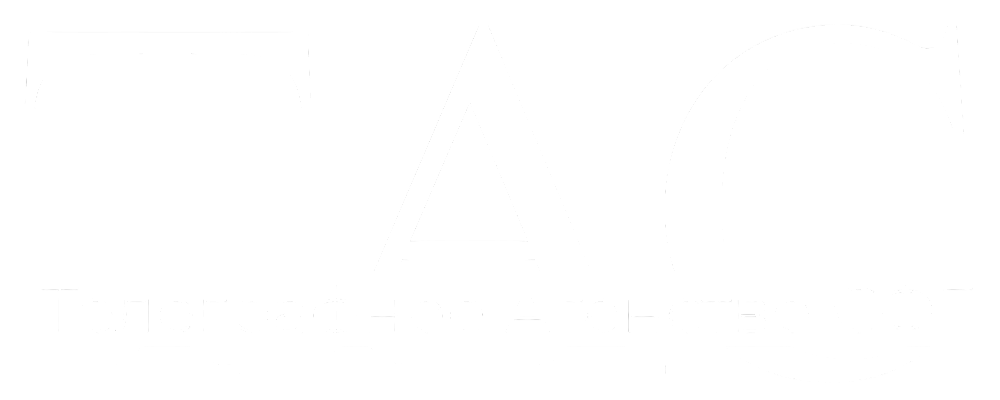

# Большая Энциклопедия NewEra и Эррландии
{ .theme-light loading=lazy }
{ .theme-dark loading=lazy }

**Большая Энциклопедия NewEra и Эррландии** — это открытый архив знаний о Эррландии, созданном сообществом игроков. Здесь вы найдёте:

-   :material-book-open-variant:{ .lg .middle } **Лор**
    ---
    Термины, идеологии, география, символика и документы.
    [:octicons-arrow-right-24: Перейти](lore/)

-   :material-clock-outline:{ .lg .middle } **История**
    ---
    Войны, операции, события, революции и военные преступления.
    [:octicons-arrow-right-24: Перейти](history/)

-   :material-domain:{ .lg .middle } **Организации**
    ---
    Государства, военные структуры, партии, союзы, культы и прочие организации
    [:octicons-arrow-right-24: Перейти](organizations/)

-   :material-account-group:{ .lg .middle } **Личности**
    ---
    Игроки NewEra, так или иначе оставившие свой след в истории и о которых хоть что-либо известно.
    [:octicons-arrow-right-24: Перейти](characters/)

---

!!! tip "Хотите внести вклад?"
    Прочитайте [Руководство редактора](contributing.md) - там всё просто!