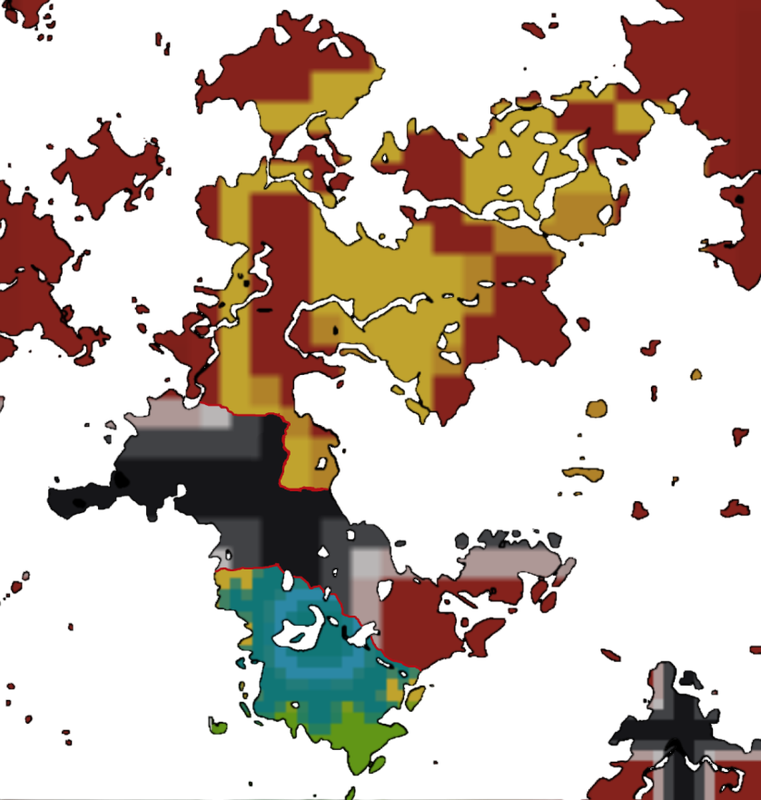
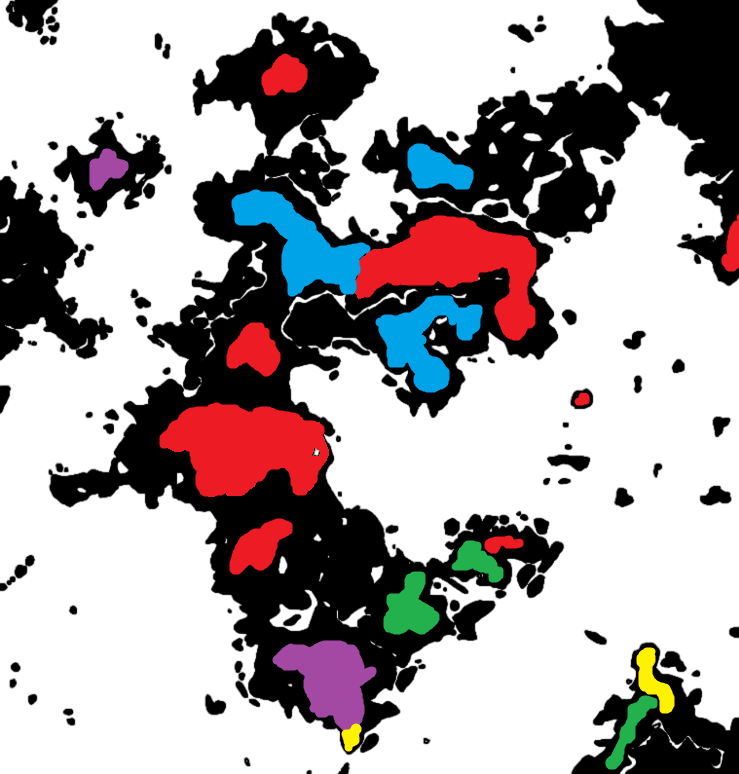

## Бернвудская Эрия (Eretz-Bernhudi aErie)

**Бернвудская Эрия (Eretz-Bernhudi aErie)** - имеет несколько значений:

1. Период эррландской истории с момента ухода LaSkao до конца 1НЕ;
2. Континент, центральная территория измерения 1НЕ, населенная народами бернвудцев, морийцев, эрийцев, минцев и белийцев.

### Политическая карта Бернвудской Эрии

<figure markdown>

</figure>

### Карта народов Бернвудской Эрии:  

<figure markdown>

<figcaption>
Красный - Бернвудцы 
Синий - Морийцы 
Фиолетовый - Эрийцы 
Зелёный - Минцы 
Жёлтый - Белийцы
</figcaption>
</figure>

---

## Население

- Март 2022 - около 15 человек  
- Апрель 2022 - около 25 человек  
- Май 2022 - около 29 человек  
- Июнь - около 36 человек  
- Июль - около 30 человек  
- Август - около 32 человек

## Состав населения

- Март: эрийцы - 9, бернвудцы - 4, минцы - 2  
- Апрель: эрийцы - 7, бернвудцы - 6, минцы - 12  
- Май: эрийцы - 8, бернвудцы - 12, минцы - 4, белийцы - 2, морийцы - 3  
- Июнь: эрийцы - 5, бернвудцы - 21, цефеиты (колонисты) - 3, морийцы - 5, эбенградцы (колонисты) - 2.  
- Июль: эрийцы - 4, бернвудцы - 23, морийцы - 4, минцы - 1

## Государства
- Новая Эррландия
- Берлинский Рейх
- Советская Федерация Городов

## Выходцы

- daynikene (бернвудец)
- https\_Liss (мориец)
- roll203203 (бернвудец)
- ShiShak (минец)
- LaSkao (минец)
- petroglif (бернвудец)
- pavelsmechalev (бернвудец)  