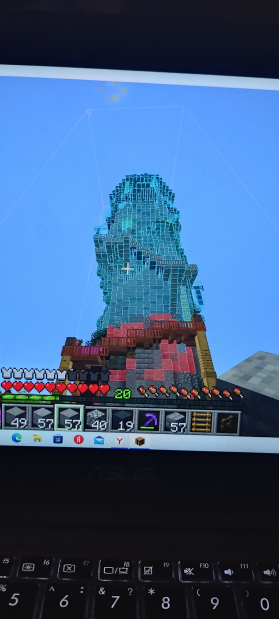

**Башня Мучачи** - фразеологизм, имеющий три значения:

1.  Утопия. То, что невозможно построить.
2.  Долгострой.
3.  Постройка, не имеющая смысла. Расположенная в неудобном месте. Абсурдная.

<figure markdown>

<small><figcaption>ЕБУЧИЙ МУЧАЧА НЕ СМОГ СДЕЛАТЬ СКРИН. СЫН ЭКРАННЫХ БЛИКОВ</figcaption></small>
</figure>

Фразеологизм появился на 1НЕ, в городе Морио. Объектом стала недостроенная башня Мучачи, поставленная прямо посреди дороги и не имеющая смысла.

Башня так и не была достроена. Сам Мучача претензий не понял и решил создать Партию Еды.