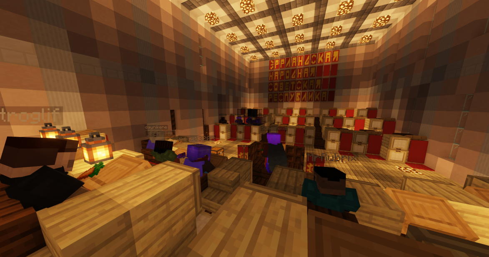
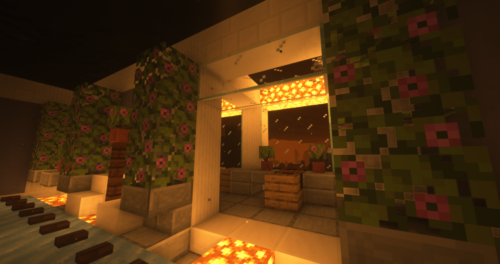
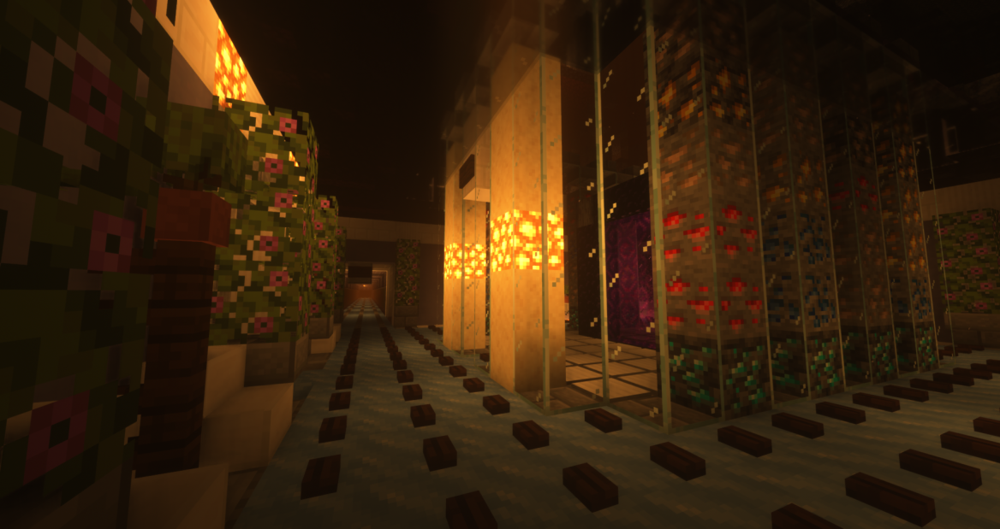
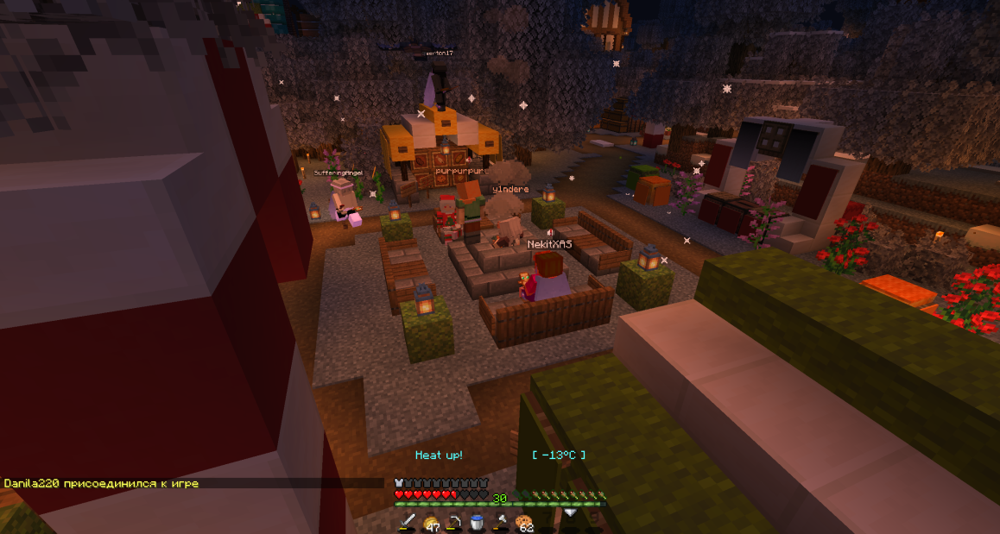

**Эпоха "Шага до Коммунизма"** - промежуток времени, с 16-го Декабря по конец Января. Эпоха характеризовалась расцветом сервера, увеличением онлайна, ослаблением роли администрации в жизни игроков, начавшимся после завершения 3-го Московского Процесса, уменьшением количества преступлений и т.д.

Эпоха "Шага до Коммунизма" стала образцовым примером существования Эррландии и идеалом для последующих движений, таких как Зоопарк, Союз Сентября, СФГ (Эррландия) и проч.

За этот период было увеличено промышленное производство общественных ферм и колхозов, впервые, с зимы 2021 года, начали массово проводится ивенты. Политика, на время, потеряла свой кровавый облик. Эррландия погрузилась в свои первые, и последние, золотые времена.

"Шаг до Коммунизма" закончился внезапно. К концу Января в Администрации возобновились эрийские настроения. За несколько недель Администрация развернула масштабный террор, который коммунисты и сентябристы позже обзовут "Новым Декабрем". Террор, массовый и беспричинный, привел к скорому падению онлайна. До этого Дайникен покинул Эррландию, по возвращению которого был проведен вайп.

Золотая эпоха Эрии закончилась из-за нераспущенной во время администрации. Консервативные и эрийские настроения которой, не дали Эррландскому обществу сделать этот последний шаг.