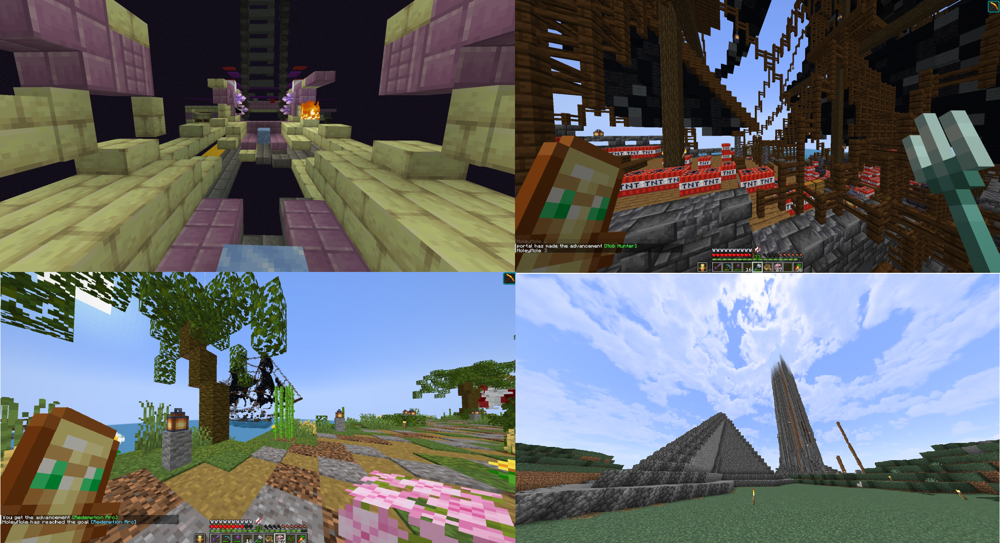

**Эррландский терроризм** - явление, ставшее ярко выраженным после [конца Первой Эпохи НЕ](/Raspad-EHSSR-12-06). Самыми явными акторами терроризма являлся [Союз Сентября](/Soyuz-Sentyabrya-10-05) на 4НЕ и СФГ на 5НЕ. До того Эррландский терроризм существовал как явление для устрашения, применяемое различными партиями и объединениями, а после стал методом возмездия, который не подразумевал реакции со стороны терроризированного объекта, либо попыткой лично отомстить людям, по мнению террористов, повинных в каких-либо преступлениях или перегибах. Ранний эррландский терроризм был менее радикален и разрушителен.

---

<figure markdown>

<figcaption>1. Взорванная ферма опыта (поздний период) 
2. Заминированный корабль. г. Тортуга (поздний период) 
3. Взорванный корабль в г. Тортуга (поздний период) 
4. Построенные в знак протеста лавакаты возле г. Эра. (ранний период)</figcaption>
</figure>

## Эррландский Терроризм

**Представители**:

- [СФГ Эррландия](/Sovetskaya-Federaciya-Gorodov-05-24)
- [Союз Сентября](/Soyuz-Sentyabrya-10-05)
- [ПБКА](/Partiya-Bez-Krutoj-Abbreviatury-07-31)-[ПАРНАС](/Partiya-Narodnoj-Svobody-07-31)
- Швейцарцы
- Сторонники Верховного Совета ЭССР (Черный Март).

**Известные теракты**: Подрыв путей сообщения Берлина (Холодная Война), Бурдж Халифа (Протест против Яндере), Попытка убийства Латоника на митинге ПБКА, Взрыв дома в Сан-Державиле, Захват заложников в Доме Лунной Палаты (событие Сентябристского Мятежа 21-го Августа), Теракт на дебатах в г. Ленинграде (4НЕ), Взрывы домов в г. Ласкао (5НЕ), Взрывы домов на Тартуге (5НЕ), Подрыв Фермы Опыта на КП (5НЕ), Мародерство астральских Тюрем (5НЕ), Визер в КПЗ (5НЕ), Убийство бомбистами астральских полицейских (5НЕ), Взрывы в столице и магазинах Астрала (5НЕ).