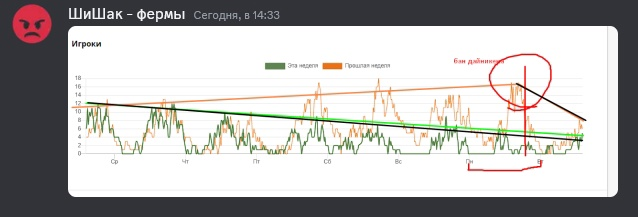
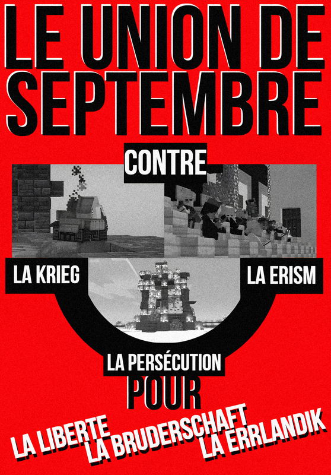

<small markdown>
Не путать с [Эрия](), [Религиозный Эризм](), [Эризм НПО](), [Религиозный Лунизм](), [Сепультурская Секта]()
</small>

!!! danger "Эризм признан экстремистской идеологией"
	Задачей политтехнологов является выявление вредных эристских заблуждений и их развенчание.

## Эризм

**Эризм (от erine (_эррландск_.) - центральные люди (буквально) администрация, элита)** - идеология, целью которой является сохранение контроля Администрации или правящей элиты над сервером, возвеличивание её, уравнивание интересов админ. состава (или элиты) с интересами сервера, создание и поддержка Эристских РП-Государств.

Эризм является довольно молодым термином, который объединяет целый спектр идей по общему признаку - максимальной поддержке диктата Администрации и Кланов. Эристы относятся к интересам Администрации, как к образующим сервер и считают их первичными. Помимо этого, эристы, зачастую, ставят на особый статус бытовое РП и Хард-РП, при условии, что в таком РП нет политических и социальных аспектов.

Эризм, несмотря на хорошее отношение к Хард-РП, противостоял РП-государству как политическому и социальному институту, считая необходимым контроль РП-Государства Администрацией.

---

<figure markdown>

<figcaption>Флаг Державного Края</figcaption>
</figure>

---

<figure markdown>

<figcaption>Флаг Эрийского Союза</figcaption>
</figure>

---

<figure markdown>
{ loading=lazy }
<figcaption>Флаг Лунной Эррландской Республики</figcaption>
</figure>

---

<figure markdown>
{ loading=lazy }
<figcaption>Флаг Астральской Федерации</figcaption>
</figure>

---

Идеологически эризм разделен на несколько этапов: пре-эризм, классический эризм, лунизм. Каждый из них отличался степенью радикальности, но всегда наделял особыми свойствами РП-процессы и Администрацию, был субъективен и идеалистичен. Исторически эризму противостояли эррландские левые и сентябристы.

## Пре-эризм

Пре-эризм появился еще на 1-й НЕ. Одной из главных организаций пре-эристов ранней НЕ являлся Культ Авиор, против которого левые, уже тогда, разворачивали борьбу. К ней можно отнести события 15-го Мая 2022 года. В этот день главой спавна и одним из создателей сервера - Авиорой - был выдвинут проект расширения границ спавна. Это было не принято игроками, вышедшими на митинг, на котором была создана КПЭ. Авиора, вскоре, была забанена по решению игроков за строительство спавна в творческом режиме. Впоследствии пре-эризм сконцентрировался в ПБКА-ПАРНАС. Пре-эризм характеризуется тем, что не считает РП-процесс образующим и не возвышает его, однако, пре-эристы считают культуру основой эррландского государства. Большинство пре-эристов выступали против использования творческого режима для развития РП. Пре-эристы являлись активными противниками КПЭ и её основного проекта - проекта национализации -, считая его губительным для сервера и РП-процессов. Пре-эризм был разбит во время Красного террора. Однако, некоторые деятели пре-эризма, такие как Яндере и Фелис, выступавшие против Латоника и пр., после создадут новое движение, которое погубит сервер.

## Классический Эризм

Эризм являет собой сердцевину всех идеалистических и антиэррландских движений, существовавших на НЕ. Основными тезисами классического Эризма является: полный примат РП-институтов над производством и экономикой, наделение администрации абсолютной и неограниченной властью, использование всех методов (в том числе и творческого режима) для развития РП. Пиком эризма стал [Мартовский съезд](/Sezd-Verhovnogo-Soveta-EHSSR-8-go-Marta-2023-goda-11-21), на котором он сформировался как единая система.

Классический эризм опровергался Дайникеном и деятелями Эррландского коммунизма в статье "Администрация и революция", а его методы до сих пор считаются абсурдными. Во втором томе "Социализма", Дайникен пытался опровергнуть эризм, однако, тот стал де-факто государственной идеологией нового [Эрийского Союза](/EHrijskij-Soyuz-07-08). В разговоре с Петроглифом, Дайникен и Рубрикс сказали, что серверу осталось полтора месяца. Спустя +- месяц, после начала проведения эрийской политики (14 марта), сервер был закрыт (19 апреля). Наделение администрации абсолютными полномочиями, разрушение экономики, "Лихая Весна" - все это вызвало отток игроков в СФГ или на другие сервера. Эризм, в головах членов СФГ, стал идеологией упадка - вредной, разрушительной и опасной.

## Лунизм

Лунизм возник на 4НЕ как реакция на Эррландский красный национализм и расширение СФГЭ. Лунизм отступил от радикальных позиций по поводу администрации, однако в остальном остался тем-же эризмом. Администрацией было создано марионеточное РП-правительство в лице Лунной палаты, в большинстве состоящей из игроков - бывших членов [Эрийского архива](/EHrijskij-Arhiv-07-08) или граждан Сепультуры (Лунограда). Противниками лунизма стал [Союз 1-го Сентября](/Soyuz-Sentyabrya-10-05), состоящий из игроков, помнящих события [Черного Марта](/Sobytiya-8-14-marta-2023-goda-11-04). После Сентябристского Мятежа 21-го Августа и установления Лунной Диктатуры к концу Августа онлайн начал стремительно падать, что опять доказало несостоятельность эризма.

07.09.2023 большинство Сентябристов было разбанено, а на территории сервера развернулась масштабная компания антилунистского террора, но, несмотря на меры Революционного Правительства, ушедшие игроки не возвращались, а новые, из-за падения рейтинга сервера, не приходили. 19 октября, поле ухода Дайникена в отставку, был совершен Лунистский Переворот, положивший конец последнему Эррландскому серверу.

## Астральский Эризм

Астральский эризм был ярко выражен тем, что Администрация использовала крупные ПВП и ПВЕ организации для контроля за РП-Государством. Любые реформы такого государства, если и проходили мимо крупных организаций, блокировались напрямую Админами, заседающими в Парламенте.

Помимо этого, через РП-Государство создавалась машина эристского террора в виде тюрем, пунктов заключения и усиления полиции.

---

<figure markdown>
{ loading=lazy }
<figcaption>Плакат С-С: Против войны, погромов и эризма</figcaption>
</figure>

