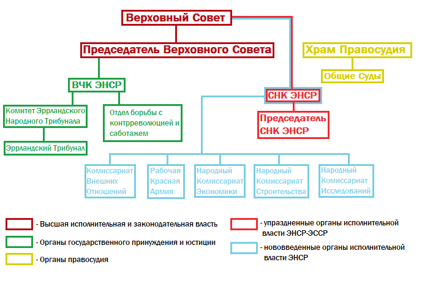
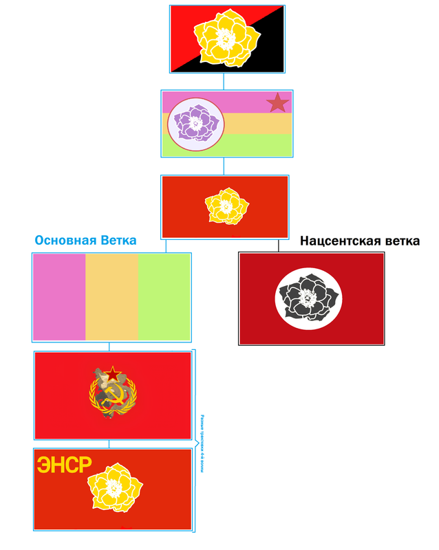

<figure markdown>

<figcaption>Виды Сентябризма (слева-направо сверху-вниз): 
1. Сентябризм 3-й Волны 
2. Нео-Сентябризм 
3. Сентябризм 2-й Волны 
4. Сентябризм 1-й Волны</figcaption>
</figure>

---

## Волны сентябризма

Данная идеология изменялась и дополнялась каждой новой волной Союза Сентября.

Так, **Первая волна** противостояла как СФГ Эррландии, так и Лунному правительству, характеризовалась анархизмом и скептицизмом к ЭНСР.

**Сентябризм 2-й Волны**, напротив, заключался в поддержке СФГ Эррландии в борьбе с Лунной Эррландской Республикой, именно тут появляется основная идея Сентябризма - восстановление II Эррландской Республики.

**Сентябризм 3-й Волны**, появившийся через несколько дней после Сентябристского Восстания 21-го Августа, характеризовался ненавистью к Лунной Палате, реваншизмом. Полностью утвердилась идея восстановления ЭНСР. У сентябристов возникла идея ненависти к Администрации, очень схожая на идею времен Развала ЭССР о ненадобности администрации на сервере с социализмом и о вреде администрации коммунизму. Сентябризм 3-й волны являлся основой сентябристской идеей до осени-зимы 2024-го года.  
Идея ограничивать администрацию была взята из ЭНСР, где формальная линия между РП-властью и Администрацией намеренно размывалась, а в эпоху "Шага до Коммунизма", правила, фактически, начали писать игроки, редактируя и принимая Кодексы.

---

<figure markdown>

<figcaption>Закрепление РП-правил (Конституции, Уголовного, Трудового и Торгового Кодексов) в Правилах Сервера НЕ.</figcaption>
</figure>

---

**Нео-сентябризм** появился после событий 28 вандемьера. Он являлся идеологией IV ЭР в изгнании до декабря 2023 года, когда стало понятно, что все эррландские сервера были закрыты, а потому восстановление Эррландии зависит только от СФГ и Эррландских коммунистов.

**Сентябризм 4-й волны** - современная стадия сентябризма, присущая 5НЕ и эпохе конца "Бездомной Эррландии". На данном этапе, идеология получила окончательное обрамление. Сформировалась основная идея: создание ЭНСР и распространение эррландской культуры. Были сформулированы основные правовые нормы и отличительные черты Сентябристских Государств: парламентская республика, создание высшего источника права - [перманента](/Permanent-EHrrlandskoj-Narodnoj-Sovetskoj-Respubliki-09-19), безальтернативные (кандидат: за/против) выборы, право на восстание, создание чёткой системы государственной власти.

Несмотря на это, данное течение различалось в зависимости от объединений. Так, в СФГЭ сохраняется абсолютная власть СНК, а Верх. Совет выступал лишь совещательным органом. В ЭНСР же, Верх. Совет обладает абсолютными полномочиями.

Отличительными чертами сетябристских государств являются лозунги или символы. Так, на гербе или флаге могут использоваться эррландские лотосы или республиканские цвета. Примером может служить ЭНСР (герб-лотос), СФГ (республиканская звезда на флаге). Или же, на гербе или флаге могут присутствовать лозунги: "Мы исправляем чужие ошибки", "Imperasion Errladika" и другие.

Осень-зима 2024 стала временем Сентябристских революций. Так, сентябристы окончательно утвердились в Фолькграде, проводят политические реформы в Юдовии и воюют за уничтожение тюрем на Астрале.

---
<figure markdown>

<figcaption>Государственное устройство Пятой Эррландской Республики</figcaption>
</figure>

---

## Национал-Сентябризм

**Национал-Сентябризм**. Одна из ветвей 4-й волны, которая отличается радикализмом, желанием создания V Эррландской всесерверной Республики, неотступничеством. Нацсенты считают, что необходимо возродить не просто ЭНСР, а её конечную фазу - ЭССР, отменить частную собственность и, в конечном итоге, уничтожить администрацию как аппарат диктатуры. При этом, нацсенты стоят за полное уничтожение вражеских Эррландии объединений, их культуры и этнического самоопределения.

Нацсенты считают, что РП-Государство должно быть выше администрации во всём, но при этом, это государство должно быть полностью демократическим и представлять интересы каждой группы внутри сервера, а не абстрактного большинства игроков.

Их политическими тезисами являются: **формула 3-4-2** (три месяца сервер должен существовать в условиях невмешательства государства в экономику, 4 месяца в условиях государственного капитализма и 2 в условиях плановой экономики), **V Эррландская Всесерверная** (националистическая идея о "триумфе эррландского народа"), **интересы государства эмерджентны** (РП-государство должно лавировать между интересами всех организаций, а не идти на поводу у абстрактного большинства игроков), **неравный федерализм** (некоторые объединения должны обладать большими правами, чем другие в парадигме влияния на регионы измерения).

---

<figure markdown>

</figure>