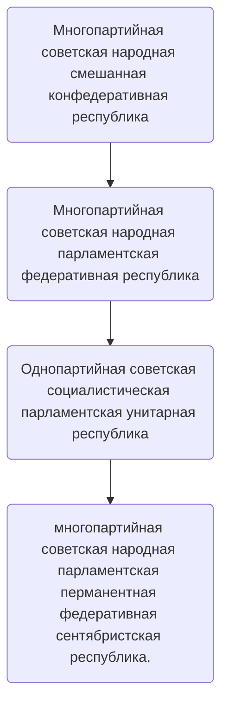

# Эррландская Народная Советская Республика*

*\*есть 2 государства с таким названием*
=== "ЭНСР-ЭССР"
    **ЭНСР-ЭССР (в формулировке II Республика; Республика Всех Эррландцев)**

```
Территориальное образование, пре-эристское государство, существовавшее большую часть 2-й НЕ. Неразрывно связана с историей СФГ и КПЭ. Величайшее Эррландское государство. Ни на одном последующем или предыдущем сезоне/государстве Эррландия не могла достичь показателей ЭНСР-ЭССР ни по онлайну, ни по экономическому росту, ни по уровню производства.

Занимало всю территорию сервера НЕ. Является предшественником ЭССР, поэтому упоминается как ЭНСР-ЭССР.
```

\=== "ЭНСР"
	**ЭНСР (в формулировке V Республика)**

```
Территориальное образование, сентябристское государство, существующее с момента Учредительного Собрания Союза Сентября (23-го Сентября 2024). Изначально сепарировалась от Астральской Федерации. После Астрало-Эррландской войны была официально признана субъектом, но через 1.5 месяца (19-го Января) ушла с проекта. 

С 14-го Апреля 2026 года - Всесерверная Республика эрийского измерения и создательница New Erы.
```

- - -


{ .center-img loading=lazy }

Герб ЭНСР (II Республики)\
01.09.22-08.03.23
{:.center}

- - -


{ .center-img loading=lazy }

Герб ЭНСР (V республики)\
23.09.24-01.01.25
{:.center}

- - -


{ .center-img loading=lazy }
Герб ЭНСР (V республики)\
01.01.25-25.03.25
{:.center}

- - -


{ .center-img loading=lazy }

Герб ЭНСР (V Республики)\
с 25.03.25
{:.center}

- - -


{ .center-img loading=lazy }

Флаг ЭНСР
{:.center}

- - -


{ .center-img loading=lazy }

Астральская Кампания. ЭНСР выделена красным.\
14.12.24-19.01.25
{:.center}

- - -


{ .center-img loading=lazy }

Карта передела территорий ЭНСР после Исхода из Астрала
{:.center}

- - -


{ .center-img loading=lazy }\
\
Герб Эррландской Комендатуры Винериумского Измерения
{:.center}

- - -

## ЭНСР

* **Существовала:** 01.09.22-13.01.23 или 01.09.2022-08.03.2023 (с учетом ЭССР).
* **Восстановлено**: 23.09.24
* **Преемник:** 
  		- Эррландская Советская Социалистическая Республика (преемник ЭНСР); 
  		- Эрийский Союз (юридический приемник ЭНСР-ЭССР); 
  		- СФГ Эррландия (фактический преемник ЭНСР-ЭССР). 
* **Преемники на территории Астральского Измерения:** 
  		- Люсмитское Княжество, Фатуйская Республика
  		- Фолькградская Эррландская Сентябристская Республика
  		- Израильская Эррландская Сентябристская Республика
  		- Вратская Эррландская Сентябристская Республика.
* **Крупнейшие города:** 
  		- Москва
  		- Эра
  		- Лапартурианство
  		- Кошкольверн
  		- Вьетнам
  		- Сан-Державиль
  		- Гарлок
  		- Эра
  		- Фолькград
  		- Израиль.
* **Столица:** Эра (2НЕ); Эра (5НЕ).
* **Языки:** русский, украинский, белорусский.
* **Денежная единица:** алмаз (2НЕ); АР, Эррландский Рубль (5НЕ).
* **Форма правления:** 



* **Гимн**: Интернационал (II Республика), Передозировка (V Республика).
* **Девиз**: 
  		- Пролетарии соединяйтесь! (II Республика);
  		- Мы исправляем чужие ошибки! (официальный, V Республика);
  		- Делай с нами, делай как мы, делай лучше нас! (один из неофициальных, V Республика);
  		- Вновь лотоса раскрылся цветок! (девиз Верховного Совета ЭНСР, неофициальный, V Республика);
  		- Ни копейки сукам на спавне! (Девиз экономического комиссариата, неофициальный, V Республика).

**Официальное СМИ**: [Телеграфное Агентство СФГ](Телеграфное-Агенство-СФГ.md)

**Сайт**: [https://errlandianiperemogaibyde.tilda.ws](https://errlandianiperemogaibyde.tilda.ws/)

### Союзники и дружественные организации:

* Мителянская Федерация  
* Юдовская Сентябристская Республика  
* Легион 856  
* Коалиция Астрал (СОД)  
* Автократы  
* Царство Люсмитское  
* ЧПК "Кремль"  
* Кироюсура  
* Русская Община г. Нефтюганск  
* Коммунальщина  
* ЧПК "Вонючий Ветер"  
* ЧПК "Мухтар"  

### Исторические противники:

* Эрийский Союз  
* Астральская Федерация  
* Витийская Республика  
* Витийская Коалиция  
* Украина

### Конфликты

* Советско-Державская Война
* Лапартурианская Операция
* Чёрный Март
* Астрало-Эррландская война.

- - -

## Главы Государства

### Период II Республики

* **Высший орган законодательной и исполнительной власти** - Верховный Совет ЭНСР-ЭССР.
* **Председатель Верховного Совета ЭНСР:** daynikene (последний)
* **Председатель СНК ЭНСР:** wertyjerry (последний)
* **Зам. Председателя Верховного Совета ЭНСР:** [SweetFelis](SweetFelis.md) (последний)
* **Нарком Перспективного Планирования:** petroglif
* **Глава ОБсКС-ФСИН:** MrRubrix (последний)
* **Глава ВЧК:** [SweetFelis](SweetFelis.md) (последний)
* **Председатель Верховного Суда:** MrVaiTsun

### Период V Республики

* **Высший орган законодательной и исполнительной власти** - Верховный Совет ЭНСР.
* **Депутаты Верховного Совета ЭНСР:**\
  		- prall, daynikene, Smile_Face, portal, sasha\_soul, 𝑲𝒍𝒂𝒖𝒔\_𝑹𝒊𝒄𝒉𝒕𝒆𝒓, kama54, panik (c 23.09.24 по 24.10.24)\
  		- daynikene, Smile\_Face, portal, 𝑲𝒍𝒂𝒖𝒔\_𝑹𝒊𝒄𝒉𝒕𝒆𝒓, panik, 1xchelx1 (с 24.10.24 по 25.11.24)\
  		- daynikene, Smile\_Face, portal, 𝑲𝒍𝒂𝒖𝒔\_𝑹𝒊𝒄𝒉𝒕𝒆𝒓, panik, 1xchelx1, SanBan, fishka_winter (с 25.11.24 по 25.12.24)\
  		- daynikene, 𝑲𝒍𝒂𝒖𝒔_𝑹𝒊𝒄𝒉𝒕𝒆𝒓, SanBan, fishka_winter, Генрисон, nicktytbydet, Pral11 (с 25.12.24 по 25.03.25)\
  		- daynikene, 𝑲𝒍𝒂𝒖𝒔_𝑹𝒊𝒄𝒉𝒕𝒆𝒓, SanBan, fishka_winter, Генрисон, nicktytbydet, petroglif, portal (c 25.03.25 по 25.05.25)\
  		- daynikene, 𝑲𝒍𝒂𝒖𝒔_𝑹𝒊𝒄𝒉𝒕𝒆𝒓, SanBan, fishka_winter, Генрисон, nicktytbydet, Kad_den, SoLdAtEn_682, Smile_Face, Flogmaut, LisiChek, https_Liss (с 25.05.25)
* **Председатель Верховного Совета ЭНСР**: daynikene
* **Комиссары РКА**: petroglif; Pral11, Myzukant
* **Комиссар Экономики**: Neoboom → отсутствует → Flogmaut
* **Комиссар Строительства**: toshikimira → https_Liss → MrBavSky → отсутствует
* **Комиссар Внешних Отношений**: Smile_Face → kama\_54 → 𝑲𝒍𝒂𝒖𝒔\_𝑹𝒊𝒄𝒉𝒕𝒆𝒓 → отсутствует

- - -

## История

### II Республика

* Образование  
* Президентский период  
* Реформы Фелиса  
* Советско-Державский конфликт  
* Отмена должности президента  
* Приход ко власти Дайникена  
* Дайникеновская национализация  
* Ноябрьский и Декабрьский Красный террор  
* Первый пятинедельный План  
* Расцвет Эррландии  
* Эпоха "Шага до Коммунизма"  
* Упразднение должности Председателя ВС  
* Дайникеновские реформы  
* Создание ЭССР  
* Затишье  
* Конец "Шага до Коммунизма"  
* Ввод Советских войск в Лапартурианскую Народную Республику  
* Кризис интересов Администрации  
* Контрреволюция Верхов  
* Последняя Советская попытка  
* "Новый Декабрь"  
* Мартовский Съезд  
* Черный Март  
* Распад ЭССР  
* Бездомная Эррландия  

### V Республика

* Эррландский сепаратизм  
* Образование ЭНСР  
* Теракт 1-го Октября  
* Присоединение Мэна и Города Врат  
* Теракты 7-го Октября  
* Индустриализация  
* Присоединение "69" и ЧТ Water_Axsalotl  
* Урегулирование отношений с Пиглинством  
* Астрало-Эррландская война  
* Разграбление Эры  
* Контрнаступление РКА  
* Первое взятие столицы  
* Второе взятие столицы  
* Третье взятие столицы  
* Победа в войне  
* Новая доктрина внешних отношений  
* Конфликт с Администрацией  
* Исход из Астрала  
* Витийская Кампания  
* Лунлендская Кампания  
* Аструмская Кампания  
* Винериумская Кампания  
* Репатриация и создание New Era  

## Вторая Республика

ЭНСР была провозглашена после победы КПЭ на президентских выборах. Президентом ЭНСР стал SweetFelis, председателем ВС ЭНСР - daynikene.\
Первейшая политика ЭНСР заключалась в укреплении экономики ЭНСР, с чем КПЭ прекрасно справилась.

После октябрьских выборов, на которые пришел исторический минимум людей, из-за чего КПЭ опять одержала победу, было принято решение об отмене должности Президента и перехода всей власти в руки ВС ЭНСР.

В ноябре пост председателя занимает глава КПЭ - daynikene. Он начинает проводить резкие левые реформы. Первой из них являлась национализация огромного количества ферм, принадлежащих монополистам рынка - Рамзику и Кактус.

11 ноября Верховный Трибунал ЭНСР приговорил Рамзика и Кактус к расстрелу. Так начался Красный террор, продолжавшийся до 16 декабря. В ходе террора был забанен один из создателей сервера, Клан Швейцарцев, лишены должностей некоторые командующие ВЧК.

Несмотря на это уровень жизни в ЭНСР вырос как никогда. Общественные фермы позволяли игрокам реализовывать себя так, как они хотели.

После завершения Красного Террора началась первая пятинеделька, основные пункты которой были выполнены.

Впоследствии, на Январском Съезде ВС ЭНСР, Дайникен выносит предложение об отмене должности председателя ВС ЭНСР, отмене частной собственности и учреждения ЭССР.

После создания ЭССР уровень жизни достиг пика. Онлайн бил новые, до этого неведанные отметки в 35-40 человек. К середине декабря сложилось состояние так называемого "Шага до Коммунизма".

Несмотря на это, из-за устранения классов, начали появляться новые общности. Одной из таких стала администрация, которая теперь не желала слушать РП-власть и Верх. Совет.

Доступность ресурсов сделала суды практически не нужными. Судья мог получать всего по одному делу в неделю. В силу этого, сила Храма Правосудия ослабла. Администрация перестала чувствовать его авторитет. Вскоре это приведет к "Новому Декабрю" (Это отсылает на 3 Московских Процесса, проведенных Эррландским Народным Трибуналом над игроками-контрреволюционерами в эпоху Декабрьского Красного террора) - ряду масштабных процессов над объединениями, где, несмотря на оправдательные приговоры Суда, Администрация расстреляла множество игроков, бывших членов СФГ и Депутатов. Последствием этого стал вайп.

Верховный Совет и Госпроектстрой решил, что необходимо заново развивать промышленность. Так появился проект 6-недельного плана. План был провальным. До конца его сроков не дожила не Советская Власть, ни сам сервер.

Из-за кризиса, ухода главы КПЭ -Дайникена, оппозиции игроков действующей Администрации, было решено созвать Съезд ВС ЭССР, вошедший в историю "Мартовским".

На нем, вопреки конституции, обладали правами Депутатов администраторы. Из-за идеологических разногласий КПЭ и Эристов, первая покинула Съезд. После этого, через буквально 3 дня, ЭССР прекратила официальное существование. Многие бывшие враги Советов примкнули к остаткам РКА СФГ и защитникам Верховного Совета ЭССР. Но 14-го Марта все силы обороны Эррландии были разбиты. Дайникен и Рубрикс предсказывали серверу 2 месяца, но уже 19 Апреля сервер было решено закрыть. Неограниченная власть администрации привела к тому, что настоящая Эррландия закончилась.

## Пятая Республика

Краткая история

Восстановление ЭНСР, а именно её законов и государственного строя стало одной из основных мечт эррландцев. Именно благодаря этой тяге, на 4НЕ появляется идеология Сентябризма, доминирующая в Советской Федерации - последнем оплоте Эррландской государственности.

Поиски сервера приводят Дайникена и Лисса на Астрал, где те решают остаться на долго. Астральская политическая сфера, представленная Астральской Федерацией, по мнению Эррландцев являлась загнивающей и нестабильной. В это время Дайникен укрепляет отношения с Мителянами - таким же кочевым и политизированным народом.

Вместе с главой Миттель-Империи Клаусом Рихтером Дайникен критикует правительство и со временем становится популярен в узких кругах астральских РПшеров. Во время президентства Фиринго, 19-го Сентября восстанавливается Союз 1-го Сентября. Уже 23-го Сентября, С-С проводит Учредительное Собрание, на котором присутствуют главы 3-х крупных объединений: СФГЭ, Фолькграда и Израиля. В тот же день, ЭНСР ратифицирует [Указ Верховного Совета ЭНСР №17](/Ukaz-Verhovnogo-Soveta-EHNSR-17-09-22) - документ, после принятия которого от Астральской Федерации отделяется Пятая Эррландская Республика.

АФ не признает суверенитет ЭНСР и на протяжении месяцев замалчивает проблему эррландского самоопределения. Все это заканчивается в декабре 2024. Шестого Декабря национал-сентябристы из Союза Сентября убивают метательной бомбой Астральского полицейского на улицах столицы АФ. Реакцией Главы Полиции и Президента АФ становится решение о начале Специальной Полицейской Операции на территории самопровозглашённой ЭНСР.

## Хроника Астрало-Эррландской войны, созданная ТА СФГ

[Подробнее о событиях Астрало-Эррландской войны можно узнать в отдельной статье.](Война-за-Независимость-Эррландии.md)

После окончания войны, ЭНСР пытается проводить суверенную политику, однако, из-за нежелания администрации создавать механики для ЭНСР, вскоре большинство граждан ЭНСР разочаровываются в Астрале. Приток игроков на сервер ставит точку в дискуссии: Музыкант запрещает всячески рекламировать и приглашать людей в ЭНСР. 19-го января Эррландцы уходят с Астрала.

### Внешние Отношения

Уникальной является система дипломатии, сложившаяся в 2024-году. Из-за того, что эррландцы часто меняли сервера, на каждом из них они успевали заводить знакомства. Так, за 2024-год эррландцы установили дипломатические отношения с Мителянами, Юдовцами, членами 856-легиона, Вонючим Ветром и прочими организациями.
